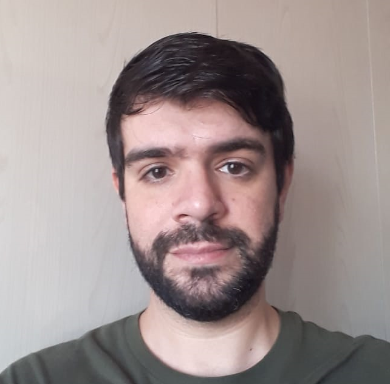

# Portfólio

I made this repo to summarise some results and codes that I've been learning since 2017. 

Here you can see my projects and know more about my code style, my workflow and my personal learning process.

## About me

Hello! My name is Raul de Sá Durlo.

I did my undergraduate degree in Economics from Maringá State University (UEM) and a Master's degree in Economics from São Paulo State University (Unesp) University.

My CV: [link to my CV](./pdf/CV_Raul_de_Sa_Durlo.pdf)

