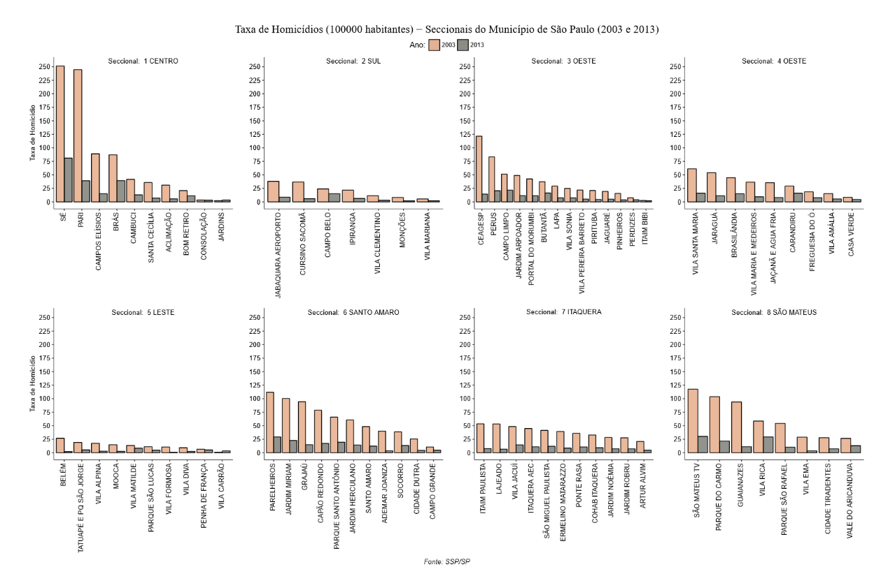

# Portfólio pessoal

Olá! :)

Seja bem vindo ao meu portfólio pessoal. Fique à vontade para explorar [meus projetos e páginas no GitHub](https://github.com/rdurl0).

## Sobre mim

Sou formado em Economia pela Universidade Estadual de Maringá (UEM) e mestre em Economia pela Universidade Estadual Paulista (Unesp).

Me interesso por programação em `R`, com enfase em temas econômicos e sociais. 

- [Neste *link*](./pdf/CV_Raul_de_Sa_Durlo.pdf) você pode consultar meu curriculo profissional.

### Atuação profissional

Atualmente sou *trainee* do programa [Inova Talentos - CNPq - IEL](http://www.portaldaindustria.com.br/inovatalentos), atuando na área de Modelagem e Precificação de Produtos Bancários no Bradesco. 

O processo seletivo para este programa consiste na resolução de um desafio proposto, sobre regressão logística.

**[Link da resposta ao desafio IEL-CNPq](https://rdurl0.github.io/Desafio-IEL-CNPq/)**

### Mestrado

Em minha dissertação de mestrado eu pesquisei sobre economia do crime, onde propus uma discussão sobre os modelos econômicos da criminalidade *a la* [Gary Becker](https://www.journals.uchicago.edu/doi/abs/10.1086/259394) em face à interdisciplinaridade deste tema. Procurei estabelecer um enfoque nos determinantes espaciais, discutindo aspectos ambientais e sociais que interferem nos custos e renda esperada que envolve a decisão individual de se cometer ou dissuadir da atividade criminosa. Com esses elementos, busquei explicar um pouco da criminalidade no município de São Paulo propondo um modelo econométrico espacial para dados de homicídio entre 2003 e 2013. O modelo identifica autocorrelação espacial da criminalidade, sugerindo agrupamentos de distritos violentos. O modelo econométrico espacial de Regressões Aparentemente Não Correlacionadas identifica efeitos de variáveis ambientais, como a proporção de domicílios em favelas, como possível determinante da criminalidade nesses locais.

**Para ver minha dissertação de mestrado [clique aqui](https://github.com/rdurl0/Dissertacao-de-Mestrado)**

## 
