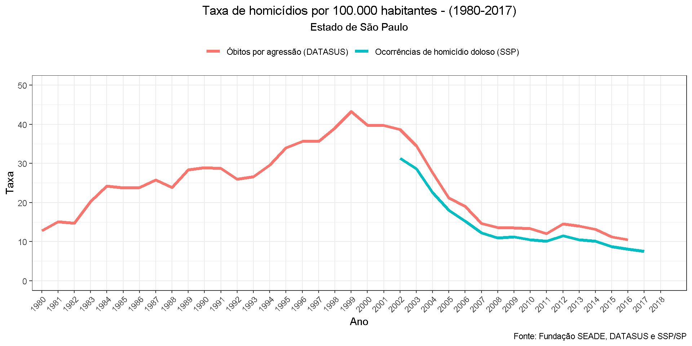

# Portfólio pessoal

Olá! :)

Seja bem vindo ao meu portfólio pessoal. Fique à vontade para explorar [meus projetos e páginas no GitHub](https://github.com/rdurl0).

## Índice

- [Sobre mim](#sobre-mim)
- [*Trainee* Bradesco/IEL/CNPq](#trainee-bradescoielcnpq)
- [Web Scraping](#web-scraping)
  - [IMP-Seade](#imp-seade) 
  - [ProPesq](#propesq)
  - [SSP - SP](#ssp-sp)
- [Visualizando dados](#visualizando-dados)
- [Modelos e pesquisa](#modelos-e-pesquisa)
- [Mestrado](#mestrado)
   
***

## Sobre mim
[Retornar ao índice](#índice)

Sou formado em Economia pela Universidade Estadual de Maringá (UEM) e mestre em Economia pela Universidade Estadual Paulista (Unesp).

Me interesso por programação em `R`, com enfase em temas econômicos e sociais. 

- [Neste *link*](./pdf/CV_Raul_de_Sa_Durlo.pdf) você pode consultar meu curriculo profissional.

**Contato**

 - **email**: <durlo.raul@gmail.com>
 - **celular**: (11) 9 7094-1437

***

## *Trainee* Bradesco/IEL/CNPq
[Retornar ao índice](#índice)

Atualmente sou *trainee* do programa [Inova Talentos - CNPq - IEL](http://www.portaldaindustria.com.br/inovatalentos), atuando na área de Modelagem e Precificação de Produtos Bancários no Bradesco. 

O processo seletivo para este programa consiste na resolução de um desafio proposto, sobre regressão logística.

**[Link da resposta ao desafio IEL-CNPq](https://rdurl0.github.io/Desafio-IEL-CNPq/docs/desafio.html)**

***

## Web Scrapping
[Retornar ao índice](#índice)

### IMP-Seade

Em uma tentativa ~~terrívelmente frustrada~~ de manter um blog, acabei documentando todo o processo que desenvolvi para extrair os dados do [IMP-Seade](https://www.imp.seade.gov.br).

- Você pode conferir o post [clicando aqui](https://randreggae.netlify.app/2019/01/21/extraindo-dados-da-api-do-seade/).

Com os dados extraídos, foi possível elaborar essa pirâmide etária da população do estado de São Paulo:

[ver código](https://rdurl0.github.io/Projeto/docs/3%5BGIF%5D_Piramide_etaria_1980-2018.html)

### ProPesq

Código desenvolvido para extrair dados com `RSelenium` do [Programa de Monitoramento da Atividade Pesqueira Marinha e Estuarina do Estado de São Paulo PMAP-SP](http://www.propesq.pesca.sp.gov.br/usuarioexterno/).

- Pra acessar o código [clique aqui](https://github.com/rdurl0/Economia_Da_Pesca/blob/master/code/raspagem_dados_propesq.R).

### SSP - SP

Raspei os dados da Secretaria de Segurança Pública de São Paulo e coloquei tudo (os dados e a funçao de raspagem) no pacote `spcrimr`. Esse trabalho foi inspirado [neste post](https://www.curso-r.com/blog/2017-05-19-scrapper-ssp/) do blog do Curso-R.

- Repositório do pacote `spcrimr` [clique aqui](https://github.com/rdurl0/spcrimr)
- Código de raspagem e limpeza dos dados da SSP-SP: [clique aqui](https://github.com/rdurl0/spcrimr2/blob/master/vignettes/SSP.md)

***

## Visualizando dados:
[Retornar ao índice](#índice)

* \[Gráfico\] Taxa de homicídios - 1980-2018 [clique aqui](https://rdurl0.github.io/Projeto/docs/0%5BGráfico%5D_Taxa_de_homicídios_-_1980-2018.html)

* \[Gráfico\] Taxas médias de homicídio 2002 - 2017 [clique aqui](https://rdurl0.github.io/Projeto/docs/01%5BGráfico%5D_Taxas_médias_de_homicídio_2002_-_2017.html)

* \[GIF\] Mais armas, mais crimes 1980-2018 [clique aqui](https://rdurl0.github.io/Projeto/docs/2%5BGIF%5D_Mais_armas,_mais_crimes_1980-2018.html)

* \[GIF\] Piramide etaria 1980-2018 [clique aqui](https://rdurl0.github.io/Projeto/docs/3%5BGIF%5D_Piramide_etaria_1980-2018.html)

* \[GIF\] Número de prisoes efetuadas 2002-2018 [clique aqui](https://rdurl0.github.io/Projeto/docs/4%5BGIF%5D_Número_de_prisoes_efetuadas_2002-2018.html)

* \[Gráfico\] Prisoes flagrantes e mandato 2002-2018 [clique aqui](https://rdurl0.github.io/Projeto/docs/5%5BGráfico%5D_Prisoes_flagrantes_e_mandato_2002-2018.html)

* \[GIF\] Taxa de homicídios e densidade demográfica 2002-1980 [clique aqui](https://rdurl0.github.io/Projeto/docs/6%5BGIF%5D_Taxa_de_homicídios_e_densidade_demográfica_2002-1980.html)

* \[Gráfico\] Taxa de suicidios 2002-2018 [clique aqui](https://rdurl0.github.io/Projeto/docs/7%5BGráfico%5D_Taxa_de_suicidios_2002-2018.html)

* \[Mapa\] Estatísticas demográficas - Estado de São Paulo [clique aqui](https://github.com/rdurl0/economia_do_crime/blob/master/report/2_2_analysis_demogr.md)

* \[Mapa\] Disponibilidade de Equipamentos de mamografia no estado do Paraná: [clique aqui](https://github.com/rdurl0/economia_da_saude/blob/master/3_Analise_exploratoria.md#mapas)

***

## Modelos e pesquisa
[Retornar ao índice](#índice)

* \[Repodução de artigo\] Cerqueira e Moura - 2014 [clique aqui](https://rdurl0.github.io/Projeto/docs/%5BRepodução%5D_Cerqueira_e_Moura_-_2014.html)

* \[Modelagem\] Matriz de contiguidade para econometria espacial [clique aqui](https://github.com/rdurl0/economia_da_saude/blob/master/4_Autocorrelacao_espacial.md#autocorrela%C3%A7%C3%A3o-espacial)

* \[Modelagem\] Modelo de regressão logística (presença ou não de mamógrafos e óbitos de mulheres com câncer de mama) [clique aqui](https://github.com/rdurl0/economia_da_saude/blob/master/5_Modelo_probit.md#modelo-probit)

* \[Modelagem\] Variáveis instrumentais (equações simultâneas) [Clique aqui](https://rpubs.com/RaulDurlo/variavel_instrumental)

* \[Modelagem\] Heterocedasticidade [clique aqui](https://rpubs.com/RaulDurlo/exercicio_2)

* \[Apostila\] Séries temporais [clique aqui](https://github.com/rdurl0/Economia_Da_Pesca/blob/master/report/resumo_series_temporais.pdf)

***

## Mestrado
[Retornar ao índice](#índice)

Em minha dissertação de mestrado eu pesquisei sobre economia do crime, onde propus uma discussão sobre os modelos econômicos da criminalidade *a la* [Gary Becker](https://www.journals.uchicago.edu/doi/abs/10.1086/259394) em face à interdisciplinaridade deste tema. Procurei estabelecer um enfoque nos determinantes espaciais, discutindo aspectos ambientais e sociais que interferem nos custos e renda esperada que envolve a decisão individual de se cometer ou dissuadir da atividade criminosa. Com esses elementos, busquei explicar um pouco da criminalidade no município de São Paulo propondo um modelo econométrico espacial para dados de homicídio entre 2003 e 2013. O modelo identifica autocorrelação espacial da criminalidade, sugerindo agrupamentos de distritos violentos. O modelo econométrico espacial de Regressões Aparentemente Não Correlacionadas identifica efeitos de variáveis ambientais, como a proporção de domicílios em favelas, como possível determinante da criminalidade nesses locais.

**Para ver minha dissertação de mestrado [clique aqui](https://github.com/rdurl0/Dissertacao-de-Mestrado)**

[Taxas de homicídios por Distritos Policiais no município de São Paulo (2003 - 2013)](./assets/img/homicidio_distritos.png)

[Diagrama de dispersão de Moran - Distritos Policiais no município de São Paulo (2003 - 2013)](./assets/img/moran_homicidios.png)
***
